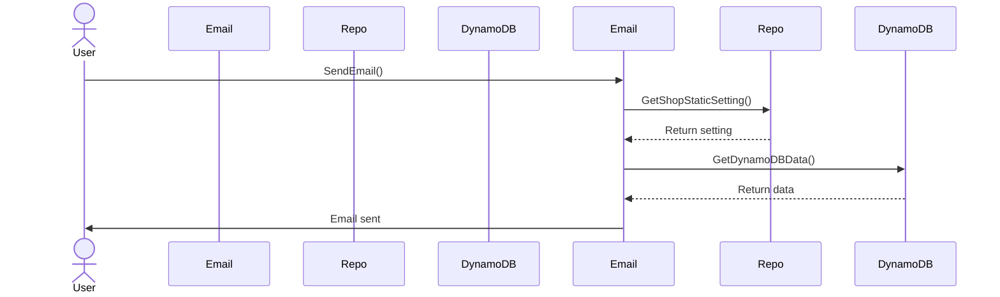
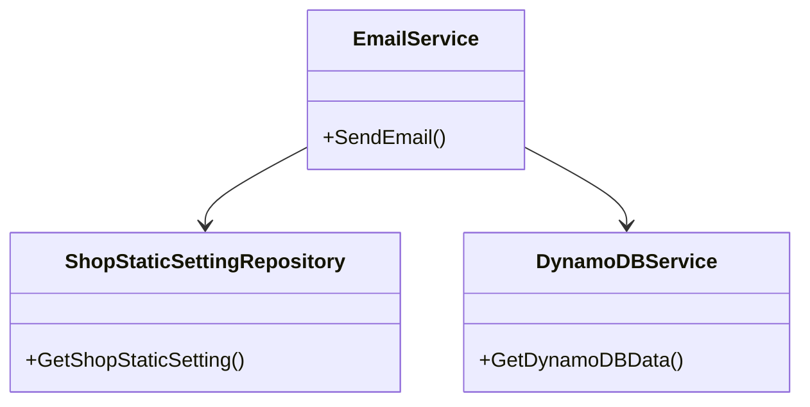

## GitHub Copilot Agent Mode Prompt: Generate Diagrams from Repomix Output

Please execute each step **in sequence**, confirming completion before proceeding to the next.

1. **Check for `repomix-output.md`** in the project root.  
   - If the file is missing, display to the user:  
     ```text
     Press Ctrl+Shift+P, type "Repomix: Run On Open Files", and execute the command.
     ```  
   - Once generated, confirm that `repomix-output.md` exists.

2. **Produce a sequence diagram** that illustrates the key interactions and flows described in `repomix-output.md`. Present it in Mermaid syntax.

3. **Produce a class diagram** that models the main classes, their attributes, and relationships as defined in `repomix-output.md`. Present it in Mermaid syntax.

4. **Ask the user to provide the work item Id** where the diagrams should be posted as a comment.

5. **Use the MCP tool `add_work_item_comment`** to write both the generated sequence diagram and class diagram (in Mermaid syntax) into the comment section of the specified work item.

> **Deliverable:** A single Markdown document containing both the Mermaid sequence diagram and Mermaid class diagram, and both diagrams must be posted into the specified work item’s comment using the MCP tool.

> **Note:** Ensure that the diagrams are clear, concise, and accurately reflect the content of `repomix-output.md`.


### Example Output

#### Mermaid Sequence Diagram



---

#### Mermaid Class Diagram



---

